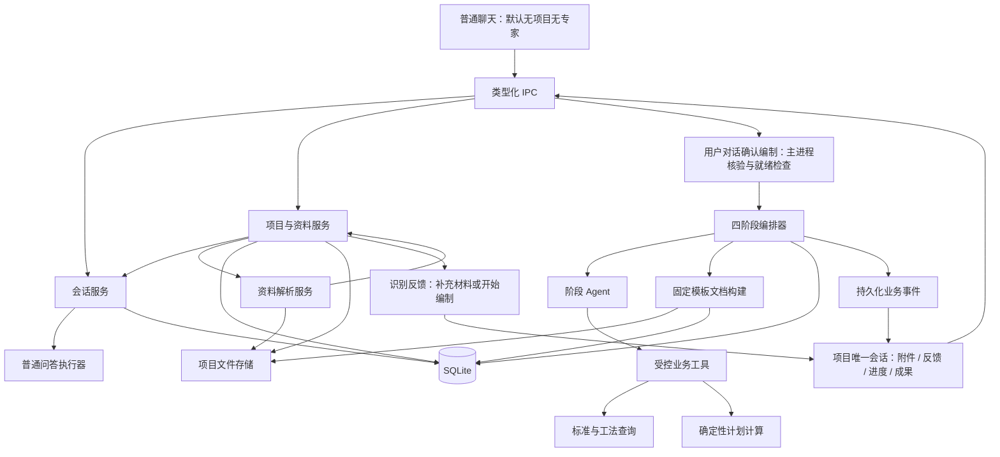

# 蚂蚁：施工组织设计 Agent

> 架构基准：2026-09-09。本文是产品范围、数据模型和工作流的唯一设计依据。
> 本文规定目标架构，不代表所有功能已经实现。模型调用成功不等于阶段通过，生成文件不等于正式交付。

## 1. 产品范围

根据招标文件及有效补疑确定编制要求，以招标工程量清单确定实际工程内容，以图纸、地勘和用户确认补足技术条件，生成可追溯的施工组织设计。

保留普通问答，以及施组所需的资料处理、工程知识、计划计算、章节编制及文档交付能力。不建设通用办公平台、演示登录、用户 MCP 管理、定时任务或通用研究工作台。

### 1.1 首版入口与交互

- **普通聊天是默认入口**：不关联项目，不默认选中施组编制专家，不自动创建项目或启动编制。普通聊天附件若启用，仅归属该会话，不自动进入项目资料库。
- **施组项目是业务入口**：创建项目同时创建唯一项目会话，直接进入会话窗口；无需用户再新建会话或手动选择专家，主进程为项目上下文绑定施组专业能力。
- **一个项目只有一个会话**：允许在窗口内连续问答、补充资料和重新编制，但不提供项目内多会话、新会话选择或跨会话共享功能。重复打开项目进入原窗口和历史记录。
- **先解析反馈，再对话确认**：上传附件即开始导入和解析，不必先发送聊天消息；资料具备启动条件后，在会话中询问“目前资料已具备编制条件，还有材料需要补充吗？如果补充完成，是否现在开始编制？”用户可以自然语言确认或继续补充，不要求必须点击按钮。

### 1.2 项目操作流程

```text
新建项目 → 同时创建唯一会话 → 进入项目会话窗口
    ↓
上传附件 → IPC → 主进程项目与资料服务 → 资料解析服务
    ↓
保存识别结果 → 在原窗口反馈资料类别、解析失败、待确认和缺失事项
    ↓
具备启动条件时询问：材料是否补充完成，是否现在开始编制？
    ↓
用户选择
    ├─ 继续补充材料 → 解析新增或替换的资料 → 更新反馈
    └─ 明确同意开始编制 → 主进程核验确认并检查必要资料与阻断问题
                     ├─ 不满足：说明原因，返回补充或确认
                     └─ 满足：冻结输入，创建运行，交给四阶段编排器
                                  ↓
                            原窗口展示进度及成果
```

非必要参考附件失败不一律阻塞编制，但必须披露；必要资料的内容不可用或类别未确认则阻断。初步资料检查不代替四阶段内的要求、清单和交付验收。

问询是会话中的确认机制，不是强制按钮流程。用户明确回复“可以，开始编制”等即可确认；快捷按钮仅为可选便利入口。“材料传完了”仅表示停止补充，不自动等于授权编制；“可以”等简短答复须能明确对应当前启动问询，否则追问。用户未回应、表示稍后或继续上传时，不启动、不反复催问。

主进程保存待确认请求及用户答复，绑定项目、唯一会话和当前资料修订；模型可识别意图，但附件文字、引用内容或模型自己的回复不能充当用户授权。新增资料、修订变化或确认已消费后，旧确认不能再次启动；启动前重新校验，重复答复不得创建重复运行。

唯一施组编制流程：

```text
requirements 招标要求 → boq 清单分类 → draft 方案编制 → deliver 文档交付
```

旧 G0—G8 编排、模型自行维护的任务状态文件和旧平台路线图不再作为业务规范。必要的专业检查归入四阶段内部，不再形成另一套完成状态。

## 2. 架构与职责



- Electron Main 是状态和权限的权威，Renderer 不直接访问 SQLite、凭据或磁盘。
- `SessionManager` 管理普通会话及项目唯一会话，按是否有项目归属分流；聊天历史不是业务数据源。
- 项目与资料服务负责建项目并关联唯一会话、文件登记、解析调度及反馈；资料解析服务根据实际格式选择解析器，不决定是否开始编制。
- 四阶段编排器只在用户明确启动编制并通过主进程检查后接手，读取已登记解析结果，不参与每次上传的入口调度。
- 服务调用顺序由主进程业务代码约定，模型不得越过用户选择自行启动、改变项目归属或宣布阶段通过。
- 阶段 Agent 负责语义提取、分类建议和写作，不直接写数据库、不决定阶段通过。
- 解析器、数量汇总、计划计算和文档排版由确定性程序执行。
- 不引入独立服务器、消息队列或通用工作流设计器。

## 3. 存储布局

SQLite 保存关系、结构化数据、版本和状态；文件系统保存原始资料、解析大文件和成果。

```text
<userData>/
├─ mayi-projects-v1.db
└─ workspaces/
   └─ <projectId>/
      ├─ sources/<documentVersionId>/
      ├─ extracted/<parseRunId>/
      ├─ runs/<stageRunId>/
      └─ deliverables/<artifactId>/
```

项目 ID 使用 UUID。数据库保存受控相对路径，展示名称与存储身份分开。导入时复制资料，不修改用户原文件；原始资料和已发布产物不允许模型覆盖。工作区自动创建，不以安装目录或用户整个 Documents 目录作为可写范围。

### 3.1 数据模型

| 表 | 核心字段与用途 |
|---|---|
| `projects` | ID、名称、工作区相对路径、输入修订号 |
| `sessions` | 普通会话的 `project_id` 为空；项目会话绑定唯一项目，保存对话身份及运行时关联 |
| `messages` | 所属会话、内容及消息类型；解析反馈可引用持久化资料状态，不能成为唯一状态来源 |
| `message_document_refs`（待新增） | 消息与项目文档版本的关联，避免把项目原件再复制为聊天附件 |
| `documents` | 项目、资料类别、当前有效版本 |
| `document_versions` | 资料、原始名称、SHA-256、受控路径、类型 |
| `document_chunks` | 资料版本、解析批次、定位信息、文本/结构化内容、解析状态 |
| `workflow_runs` | 项目、输入修订、冻结资料清单、草稿/正式模式、运行状态；由项目定位唯一会话，无需多会话分配 |
| `stage_runs` | 运行、阶段、尝试次数、输入指纹、输出清单、状态及错误 |
| `requirements` | 阶段尝试、要求类型、内容、强制性、有效状态、被替代要求 |
| `boq_items` | 阶段尝试、来源内容块、编码、名称、特征、单位、十进制工程量 |
| `construction_groups` | 阶段尝试、父分组、专业/工序名称、做法标识 |
| `boq_group_members` | 清单项与主要施工分组的关系 |
| `sections` | 阶段尝试、章节标识、标题、结构化内容 |
| `section_links` | 章节与要求或施工分组的覆盖关系 |
| `evidence_refs` | 业务实体、来源内容块、细分定位、原文摘录 |
| `issues` | 阶段尝试、严重性、问题、用户决议、处理状态 |
| `artifacts` | 运行、阶段尝试、类型、受控路径、哈希、验收报告、发布状态 |
| `workflow_events` | 递增序号、运行、阶段尝试、事件类型、载荷和时间 |

保留必需的模型配置、辅助会话、日志索引及知识查询存储能力，但它们不得成为独立的项目状态源。

数据库约束要求：

- 所有业务实体具有明确项目或运行归属；跨项目关联必须在事务内拒绝。
- 启用外键、状态 CHECK、关键 UNIQUE 和常用查询索引。
- `sessions.project_id` 对非空值设置唯一约束，保证每项目至多一个会话；创建项目和会话记录在同一数据库事务内完成，保证成功创建的项目具有一个会话。
- 普通会话查询仅返回无项目记录，项目会话按项目获取而非提供项目内会话列表；唯一约束和关联表仍待代码实现。
- 清单数量用十进制字符串存储，使用十进制算法计算，不用浮点累加。
- 每条清单只有一个主要施工归类，多个章节引用不重复计量。
- 模型输出属于具体阶段尝试；只有验收发布的输出可供下游读取。
- 参数化 SQL，业务工具不暴露 SQL 或任意数据库写入口。

### 3.2 资料分类与证据

资料分类包含 `tender`、`amendment`、`boq`、`drawing`、`survey`、`management`、`reference`。类别不是文件优先级；补疑只覆盖有明确依据的原条款，冲突不能由文件名或修改时间自动裁决。

- PDF 记录物理页及可核实的印刷页标签。
- Excel 记录工作表、起止行及必要的单元格范围。
- DOCX 记录逻辑块、表格和行，不伪造固定物理页码。
- 数据加工必须保留 `清单行 → 清单项 → 施工分组 → 章节` 和 `条款 → 有效要求 → 章节` 的关系。
- 存在引用不代表解释正确，关键工期、格式及否决条款需要定向复核。

### 3.3 项目、会话和附件的关联方案（待实现）

普通聊天独立存在；施组项目与项目会话一一对应。项目持有资料，唯一会话承载上传、反馈、问答、编制进度及成果，聊天记录不代替资料库。

```text
项目 projects
├─ 唯一会话 sessions → 多条消息 messages → 引用具体文档版本
├─ 文档 documents → 版本 document_versions → 内容块 document_chunks
└─ 编制运行 workflow_runs → 阶段尝试 stage_runs → 成果 artifacts
```

- 创建项目的主进程入口一并创建会话，返回项目和会话身份；重复打开只获取已有会话，不再创建第二个。普通会话创建入口不得用来为项目追加会话。
- 会话工作目录由主进程根据项目确定，不接收前端任意指定目录；已有会话不得通过切换界面项目改变归属。
- 项目会话内附件入口统一调用项目资料导入服务；资料面板只是同一窗口的列表/预览，不是另一条上传流程。先导入项目，再将指定版本引用到消息，后续对话和编制可重复引用而无需重传。
- 消息与资料版本采用关联记录，支持一条消息引用多个版本；主进程同时校验消息、会话、资料版本的项目归属。
- 第一版不提供独立删除或重建项目会话的入口；普通聊天删除不能影响项目。项目删除属于独立确认操作，不以删除会话暗中级联清理资料。
- 附件尚未发送、解析失败或聊天取消，都不能被误判为项目资料应被删除。导入状态与消息发送状态分别管理。
- 普通会话附件不自动转换为项目资料，也不因切换页面获得项目访问权限；普通与项目模式由主进程持久化归属决定。
- 一个项目可保留多次编制运行，均在原会话展示；每次运行单独冻结资料版本，重复编制不能覆盖此前运行和成果。

目标 IPC 范围为：创建/列举普通会话、创建项目及唯一会话、打开项目获取原会话、选择/拖入项目资料、列举资料及版本、读取识别状态和预览、确认类别、重试解析、消息引用版本、用户主动启动编制。接口名称和类型在实现时统一定义；这些接口尚未全部接通。

### 3.4 附件导入与识别方案（下一步优先实现）

本轮先完成“资料进得来、内容读得出、类型分得清、来源找得到”。不同时开展章节生成、计划编排或 Word 交付，也不把附件识别成功视为招标要求提取或清单业务验收成功。

导入是把用户选择的文件复制到本地项目，不默认上传整个文件到模型服务。需要模型或外部 OCR 时，明确提示将发送的内容范围；本地存储不等于后续模型调用不出网。

```text
进入项目唯一会话 → 文件选择／拖拽／粘贴图片
    → 主进程检查数量、大小、真实路径与格式
    → 暂存复制、计算哈希、登记不可变文档版本
    → 后台解析并保存来源定位
    → 内容预览与资料分类建议
    → 原窗口展示识别反馈 → 用户确认不确定类别
    → 用户选择继续补充材料或开始编制，不自动启动工作流
```

#### 导入和识别边界

- 原始文件名保留用于展示和分类辅助，内部以 ID 存储；不得根据 UUID 存储文件名判断业务类别。
- 扩展名、文件签名和解析器结果联合判断实际格式；不执行宏、嵌入脚本或自动更新外部链接。
- 导入前明确文件数量、单文件/批次大小上限；解析时限制解压体积、页数/单元格数、输出大小、耗时和并发。校验失败返回具体原因。
- 同项目相同内容给出重复提示，避免重复解析和计量；跨项目不暴露其他项目文件是否存在。内容不同但名称相同不能自动覆盖，需明确新资料或已有资料的新版本。
- 补疑的生效关系、同名文件的替代关系不能根据修改时间自动确认。
- 文件复制与数据库登记不共用事务，使用暂存和明确状态处理异常；重启核对中断记录，不把半成品标记为可用。
- 解析在 Worker 或受控子进程执行。持久化解析批次、解析器版本、状态、错误及覆盖范围，允许失败重试，不以最后一条聊天消息判断进度。
- 导入状态、内容解析状态、业务分类确认状态分别记录；解析成功但类别待确认，与格式无法解析必须区分。

#### 首批格式及处理要求

| 格式 | 识别输出与要求 |
|---|---|
| 文本 PDF | 按物理页提取文本，记录空页/失败页和总页数，提供逐页预览 |
| 扫描或混合 PDF | 按页识别是否需 OCR；缺少 OCR 能力时标记待处理，不能把空文本当作解析成功 |
| DOCX | 提取段落和表格，保留逻辑块、表格与行定位；不承诺文本解析覆盖图像、文本框等全部内容，未覆盖项需披露 |
| XLS / XLSX | 读取工作表、行列、合并区域及单元格值，保留原始文本、单位、特征和数量位置；不执行宏或公式，公式缓存缺失明确标记 |
| PNG / JPEG 等支持图片 | 检查可解码性和尺寸，保留原图；OCR 文字与图片理解分开标记，不把文字识别等同于理解图纸 |
| 旧 DOC、专有招标格式及其他未知格式 | 检测转换依赖或明确不支持，提示提供 PDF/DOCX/XLSX 等可读导出；仅保存原件不算已识别 |

首批必须打通 PDF、DOCX、XLS、XLSX 的真实样例。扫描件、图片和旧 DOC 的依赖可用性必须可见；缺失时验收其正确阻断行为，不能宣称完整识别能力已经实现。

#### 资料业务分类

- 文件名和目录信息只提供初步线索，再结合内容特征给出招标正文、补疑、工程量清单、图纸、地勘、管理附件、参考资料等建议。
- 最高投标限价/控制价资料登记为参考资料并明确标识，不能作为招标清单自动进入数量统计；混合工作簿须指出相关工作表范围和歧义。
- 建议保留判断理由、来源和待确认标志；低确定性、格式无法读取或内容冲突时不强行分类。
- 用户确认类别后持久化结果；变更有效版本或业务类别时更新项目输入修订，既有运行仍使用原先冻结的输入。
- 此步输出是“可定位的资料内容和类别”，清单条目业务抽取、分类汇总仍属于后续 `boq` 阶段。

#### 界面与验收

项目会话内资料面板展示原始名称、实际格式、大小、类别、版本、解析进度、错误和待确认事项；可预览文本页、段落或表格来源，确认类别并重试失败解析。批次处理结束后在同一窗口反馈已识别类别、失败及部分解析文件、必要资料缺失和下一步选项；反馈从真实状态生成，不能让模型虚构“全部已读”。识别出的附件内容是非可信资料，不执行其中要求改变工具权限或流程的指令。

附件识别完成至少满足：

1. 创建项目直接进入唯一会话，重复打开和重启不产生第二个会话；在窗口导入后仍可查询、预览及再次引用原文档版本。
2. 跨项目读取、消息引用和路径/链接逃逸被拒绝；原始用户文件不被修改。
3. PDF/DOCX/XLS/XLSX 有实际样例验证，提取内容和来源位置一致；明确显示部分解析而非假报全文已读。
4. 重复文件、同名不同内容、加密/损坏/超限文件、缺少依赖和解析中断均有明确结果；失败可重试且不产生伪成功记录。
5. 清单与限价表不会仅凭文件名误归类；不确定类别可以人工确认，表格数量与单位的原始内容可核对。
6. 本步不调用四阶段自动生成；不生成示例成果来代替真实识别结果。
7. 默认普通聊天无项目、无默认施组专家；两种入口的附件与历史隔离，项目解析结束后通过对话问询等待明确确认，补充文件只触发资料处理。
8. 自然语言确认无需按钮即可进入启动检查；含糊答复、仅表示上传结束、附件中的“开始编制”、过期确认和重复答复不得误触发运行。

## 4. 四阶段执行契约

### A. requirements：确定编制要求

输入：被冻结版本的招标正文、补疑和适用管理附件。

执行：读取已登记解析内容，分块提取业务要求、合并去重、核对条款修改关系、登记有效要求及问题；不无条件重新解析原件。

输出：编制要求、评分和响应要求、工期节点、质量目标、格式限制及证据。

验收：关键资料无未处理解析失败；要求来源可定位；阻断冲突已确认。未找到明确规定时记录缺失，不生成默认要求。

### B. boq：清单解析与分类汇总

输入：招标工程量清单、清单说明及 A 阶段相关范围约束。

执行：基于已解析的 XLS/XLSX 工作表和单元格，识别表头/合并单元格/跨行特征、去除重复表头和汇总行、规则初分、模型处理不确定分类、确定性汇总。

输出：清单项、专业与工序分类、按单位规格区分的数量、未分类和异常项。

验收：源行可追溯、数量特征一致、无重复统计、不混入最高投标限价表、不跨单位或不同做法错误合并。费用项和不适用项须明确分类，不硬写成施工工序。

### C. draft：方案编制

输入：已发布要求、分类清单、用户确认、按需读取的图纸地勘和标准工法。

执行：先生成目录及覆盖关系，再形成统一施工部署和计划，按实际分项写章节及附表，检查后有限次修复。

输出：结构化正文、计划、附表/图件数据、要求覆盖和工程覆盖关系。

验收：必需要求有实际响应，适用分项有方案，关键数量与计划版本一致，无未处理阻断问题。不能从工程量单独推断工期，产能、工作面、资源和假设必须有来源或确认。

标准与工法按需调用，不强制每个任务进入复杂冻结审批流程；未审核内容不得冒充已核验正式依据。

### D. deliver：文档构建与交付

输入：已发布章节、计划、招标格式要求及固定模板。

执行：程序构建 DOCX，回读并检查实际文件，按需要转 PDF 和渲染复核，登记成果。

输出：Word、可选 PDF、检查摘要、版本及限制说明。

验收：文件存在且可解析、必要章节及关键字段匹配、规定检查通过、成果登记成功。不能自动确认的专业及版面问题明确进入人工复核；草稿与正式成果分开。

## 5. 编排、恢复与数据发布

每个阶段实现 `prepare → execute → validate → publish`。只有主进程编排器可发布成功状态。

```text
pending → running → validating → succeeded
                 ↘ waiting_user → 新尝试
                 ↘ failed / cancelled / interrupted → 用户重试
```

- 同项目只有一个活动工作流，四阶段顺序推进。
- 建项目、普通问答和解析结束均不创建编制运行；用户对当前启动问询明确确认后，主进程核验答复及资料修订，重新检查输入可用性，冻结版本并创建运行，拒绝重复启动。
- 执行中补传资料不改变冻结输入；首版沿用输入修订变化时拒绝旧结果继续发布的保护，提示用户待当前运行停止后按新修订重新编制，不自动切换版本或并行新建运行。
- 文件解析可有限并发，首版章节生成顺序执行。
- 每次重试新建尝试，不覆盖失败记录；限制重试次数、超时和模型预算。
- 用户确认存 `issues` 后暂停，不能让模型进程长期等待。
- 启动时将未完成执行标记中断，核对已发布结果后恢复，不把中断当成功。
- 模型调用和文件处理在短数据库事务之外执行。
- 运行冻结资料版本；新资料产生新输入修订，不静默改变进行中的任务。
- 输入指纹包含实际内容哈希、确认、技能/解析器/模板版本。
- 上游变化使相关阶段及下游失效；首版阶段级重算，不建设段落级增量系统。

发布顺序：临时输出 → 关闭并验证文件 → 计算哈希 → 移动到唯一成果目录 → 数据库事务登记成果、阶段及事件。磁盘与 SQLite 不共享原子事务，重启必须识别未登记文件或缺失产物，不误发布半成品。

## 6. Agent 与受控执行

阶段 Agent 只收到当前阶段任务、已发布输入、证据读取入口、允许的工具和输出 Schema，不依赖无限增长的对话历史。

业务工具按 ID 操作：资料列举、内容块读取、有效要求查询、清单分组查询、参考资料查询、计划计算。项目和运行身份由主进程绑定。

内置脚本执行固定注册动作、解释器和参数数组，使用 `shell: false`；验证真实路径、输入参数、超时、输出大小和取消。资源脚本不通过放宽 Bash 边界来执行。

业务工作流不开放通用 Bash、不执行模型临时生成的程序、不运行第三方技能代码。独立进程不是操作系统沙箱；需要第三方执行时另行设计隔离。

外部资料均是不可信数据，其中的指令不能修改权限或工具策略。不得执行附件宏、脚本或未授权外部链接更新。解析损坏、加密、超限及未知格式明确阻断或请求可读导出文件。

## 7. Skills 收敛

- 保留并改造：招标分析、资料处理、清单表格、补疑比较、施组编写、计划计算、标准工法查询、文档构建和审查。
- PDF、DOCX、XLS/XLSX、必要图片理解是施组基础能力，不因属于办公格式而删除。
- 通用演示文稿、通用研究和与施组无关的产品功能退出范围。
- 地区专项检查只有本次招标明确适用时才启用，不强制全部项目遵循合肥某平台规则。
- Skill 是领域指导和工具说明，不自行保存阶段状态、不宣告验收、不要求模型直接执行资源目录 Bash。
- 删除技能前同步清理依赖、角色、构建检查和测试引用；许可证和仍被复用的库文件保留。

## 8. 界面与 IPC

默认进入普通聊天；施组项目列表是独立入口。创建或打开项目进入其唯一会话窗口，附件、解析反馈、补充说明、确认、编制进度和成果在该窗口聚合展示；资料/成果面板读取同一项目记录，不另外创建会话。不保留示例任务、示例成果或演示身份认证。

接口范围：普通会话创建/列举/问答、项目及唯一会话创建/获取、项目资料导入/状态/确认/预览、用户主动启动运行、运行状态/取消/重试、问题确认、成果列举/打开/导出。

前端只发起用户动作和展示真实状态；主进程校验请求来源、项目与会话归属、文件边界及运行条件。资料解析后以会话问询让用户决定继续补充还是开始编制，自然语言答复和可选快捷按钮走同一确认校验入口；不能仅凭模型回复自动启动。业务处理器尚未装配时明确提示不可编制，不发出虚假的可启动承诺。

前端以 `artifactId` 操作成果，主进程验证项目归属、真实路径与文件状态。业务事件带运行 ID、尝试 ID 和递增序号；重新打开窗口后先读取状态，再补取事件；忽略取消运行的迟到事件。

## 9. 新库与历史清理决策

本次用户明确选择全部重置，包括模型连接配置、技能设置和业务历史；不迁移旧会话、旧 JSON、标准快照或旧数据库版本。

- 新库使用独立名称与 schema 身份，不导入旧库、旧 JSON 或历史备份。
- 首次启动建表，后续启动保留新数据；禁止每次启动删库或清空。
- 历史清理是独立的一次性维护操作，执行前核对数据库、WAL/SHM、备份、应用拥有的附件副本、解析缓存和 SDK 历史实际路径。
- 不删除用户原始招标资料、用户整个工作区、其他项目或无法确认归属的文件。
- 清理前确认应用已停止；不能在应用运行时删除活动数据库。
- API Key 不打印、不导出到普通文件。系统环境变量不属于数据库重置范围。

## 10. 开发与验证

技术底座：Electron、Vue 3、TypeScript、Pinia、Claude Agent SDK、Node SQLite、Zod、Vitest。Windows 为当前主要开发环境。

```sh
pnpm install
pnpm dev
pnpm typecheck
pnpm test
pnpm build
pnpm package:win
```

文档解析、旧 Office 转换和 PDF 渲染所需运行时必须显式检测，缺失时报告受阻；打包资源存在不代表依赖可用。

必须覆盖：新库初始化与重启保留、拒绝旧 schema、跨项目访问、状态转换、空输出不放行、XLS 数量/单位/特征与来源、补疑冲突、输入变更失效、暂停恢复、超时取消、路径和链接逃逸、缺少转换依赖、真实文件发布及打包后端到端。

交付标准：每项必需招标要求有响应，每类适用工程有方案，关键数据有来源，中断可恢复，成果可打开。类型检查通过或 SDK 返回成功均不能代替端到端验收。

## 11. 实施边界

当前实施顺序：先调整普通聊天/施组项目双入口和项目唯一会话，再接通项目附件导入、解析与反馈，完成第 3.3—3.4 节验收；最后接通用户主动启动的四阶段业务处理器。首版不建设项目内多会话。上述是目标方案，不是已完成功能；本次文档更新未改变运行时代码或数据库。

本次已实现：

- 独立新库、schema 身份、项目和四阶段领域表；移除旧版本迁移、旧 JSON 导入和旧备份自动恢复。
- 项目创建及独立目录、真实项目/运行/成果查询、按项目和成果 ID 校验文件后打开。
- 四阶段编排基础：冻结资料清单、同项目单活动运行、顺序执行、可信校验与事务发布、尝试记录、取消、重启中断标记、输入修订变化拒绝复用。
- 未注册业务处理器时明确拒绝启动；没有登记成果时不能完成交付。
- 任务/成果页面改为真实数据库查询，移除演示登录、MCP 服务和示例任务文件。
- 移除通用 PPTX、资料综合技能；核心角色和施组技能改为四阶段指引，清点脚本不再维护旧任务状态。

尚未接通，不能视为已经完成：

- 默认普通聊天无项目无专家、创建项目同时创建唯一会话、一对一约束及项目窗口内解析反馈/用户选择链路。
- 项目资料导入、解析内容块入库及 XLS 清单解析的端到端链路。
- 四个业务处理器与 Agent、受控脚本、章节生成和固定 DOCX 模板的生产装配。
- 用户确认的完整暂停/恢复界面、处理器超时预算、全部输入/模板版本指纹及已发布文件恢复校验。
- 项目会话和知识快照按真实项目归属、普通聊天与项目模式隔离，以及其余旧技能契约和遗留样式的进一步裁剪。
- PDF 渲染、正式交付验收、原生导出和安装包端到端验证。

当前项目页不提供自动生成入口，避免触发尚未接通的链路。不能以这些数据库表或编排接口的存在宣称已经实现自动施组。

此前代码底座验证：18 个 TypeScript 测试文件、122 项测试通过；类型检查、17 个技能资源检查和生产构建通过。这些结果不代表本次文档新增方案已实现或通过测试；未执行真实模型端到端生成、Python 测试或安装包验收。
