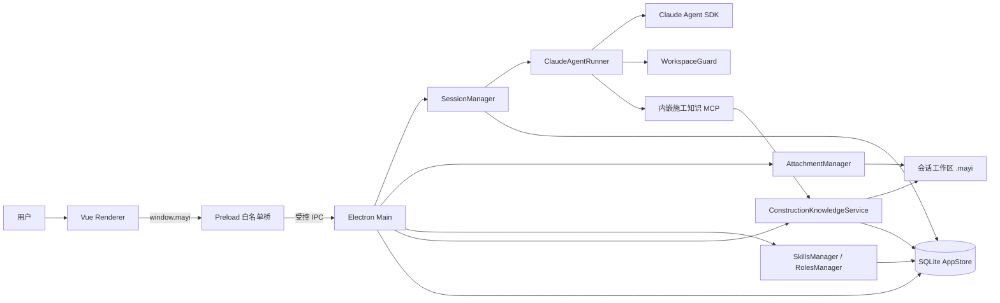

# 蚂蚁（Mayi Agent）

面向企业知识工作与工程文档协作的本地桌面 Agent。项目以 Electron 为安全宿主，集成 Claude Agent SDK、结构化会话持久化、受控文件与命令工具、专业文档 Skills，以及施工组织设计知识能力。

> 当前版本：`0.1.0`  
> 状态基线：2026-09-04  
> 当前定位：可运行的开发版本，核心聊天、会话、附件、安全工具、Skills 和部分施组确定性能力已经接通；任务中心、用户 MCP、文件库等页面仍是演示或待实现状态。

## 当前成熟度

| 模块 | 状态 | 说明 |
|---|---|---|
| 聊天与会话 | 已实现 | 支持创建、恢复、排队、取消、删除、流式输出和结构化持久化 |
| Agent 工具 | 已实现 | 支持文件、命令、Web、Skill、后台任务及受控施工知识工具 |
| 工作区安全 | 已实现 | 固定会话工作区，校验路径、符号链接、系统目录和危险命令 |
| 权限系统 | 已实现 | 支持拒绝、单次允许、本会话按工具允许、高风险二次确认和超时拒绝 |
| 附件与图片 | 已实现 | 支持办公文件、文本、代码和常见图片的受控导入与消息绑定 |
| Skills 管理 | 已实现 | 19 个内置 Skill，支持动态发现、依赖、启停和构建检查 |
| 角色系统 | 已实现基础版本 | 当前内置“施组编制专家”角色，会话创建后固定角色与技能快照 |
| 文档处理 | 已实现技能框架 | PDF、DOCX、PPTX、XLSX 能力受本机 Python、LibreOffice、Poppler 等依赖影响 |
| 施组确定性能力 | 部分实现 | 已有资料清点、计划计算、部分一致性检查、标准与工法知识服务 |
| 施工知识库 | 已实现本地闭环 | 支持标准登记、审核、缓存、快照、工法匹配、引用校验和影响追踪 |
| 官方标准在线同步 | 仅完成安全框架 | Provider 接口、白名单和暂存结构已完成，尚未注册真实官网适配器 |
| 文件库页面 | 未实现 | 当前为静态演示数据，未连接会话工作区 |
| 任务中心 | 未实现 | 当前为静态演示数据，无调度器和任务存储 |
| 用户 MCP 管理 | 未实现 | 当前页面为静态演示；仅存在应用内部施工知识 MCP |
| 企业身份认证 | 未实现 | 当前是前端演示登录，不包含 OAuth/OIDC、验证码服务或企业 SSO |

## 已实现能力

### 1. Agent 与会话

- 使用 Claude Agent SDK 执行流式 Agent 会话。
- 默认接入 DeepSeek Anthropic 兼容接口。
- 支持 `deepseek-v4-pro`、`deepseek-v4-flash`，图片消息固定使用 `glm-5.3-flash`。
- 支持 SDK 会话恢复和最多 30 轮执行。
- 同一会话严格串行，不同会话可并行运行。
- 支持取消当前执行，并拒绝该会话尚未处理的权限请求。
- 保存文本、Thinking、工具调用、工具结果、错误、Token、费用、上下文占用和耗时。

当前可用工具：

- 文件：`Read`、`Write`、`Edit`、`Glob`、`Grep`
- 命令：`Bash`
- 网络：`WebSearch`、`WebFetch`
- 技能：`Skill`
- 后台任务：`TaskOutput`、`TaskStop`
- 施工知识：根据启用 Skill 按需注入标准、工法、快照和引用校验工具

### 2. 工作区与安全边界

- 会话创建时固定工作目录，后续不允许切换。
- 拒绝磁盘根目录、Windows 系统目录、UNC 路径和工作区外绝对路径。
- 拦截 `..` 穿越、符号链接和目录连接逃逸。
- 文件工具统一经过工作区路径校验。
- `Bash` 在宿主机执行，但会经过危险命令识别、可识别路径检查和用户授权。
- 拦截磁盘与分区修改、关机、系统注册表、系统用户、服务、计划任务、编码 PowerShell 和下载后直接执行等高风险模式。
- Electron Renderer 启用 `contextIsolation` 和沙箱，禁用 Node 集成。
- Preload 仅暴露类型化白名单 API，IPC Handler 校验可信主窗口发送方。
- Markdown 禁用原始 HTML，并使用 DOMPurify 二次净化。
- 外部链接只允许 HTTP/HTTPS，并在无 Preload 的隔离窗口中打开。

> `Bash` 不是操作系统级沙箱。当前安全模型依赖静态规则、路径 containment、权限弹窗和执行日志。

### 3. 权限与审计

- 权限结果支持：拒绝、允许一次、本会话始终允许。
- 高风险工具选择“本会话允许”时需要二次确认。
- 权限请求超过 60 秒自动拒绝。
- 本会话授权当前按工具名保存，不是按具体命令或路径细分。
- 日志包含 Session ID 和 Trace ID，并执行脱敏、截断和轮转。
- API Key 由主进程读取，持久化时使用 Electron `safeStorage`。
- Base URL 默认要求 HTTPS，仅允许本机回环地址使用 HTTP，且禁止 URL 凭据、查询参数和片段。

### 4. 附件与多模态

支持文件选择、拖拽和剪贴板图片粘贴。附件经主进程校验后复制到：

```text
<会话工作区>/.mayi/attachments/<会话 ID>/
```

数据库仅保存展示元数据和受控相对路径。

| 类型 | 当前能力 | 主要边界 |
|---|---|---|
| PDF | 导入后交给 `pdf` Skill 处理 | 无页级预览、扫描页 OCR 和缩略图 |
| DOCX | 读取、创建、编辑、批注和校验工作流 | 无内置文档预览和版本管理 |
| PPTX | 读取、创建、编辑和质量检查工作流 | 无幻灯片预览和模板选择 UI |
| XLSX / CSV / TSV | 读取、编辑、分析、生成和公式处理工作流 | 公式重算依赖外部运行环境 |
| TXT / Markdown / JSON / 代码 | UTF-8 与二进制检查后由文件工具读取 | 暂无超大文本分页和多编码支持 |
| PNG / JPEG / GIF / WebP | 规范化后作为 SDK 图片块发送 | 视觉能力取决于当前兼容 Provider |
| 音频 / 视频 | 不支持 | 尚无转写、关键帧、OCR 和时间轴处理 |
| 其他二进制文件 | 默认拒绝 | 需按业务需求新增白名单和解析 Skill |

限制：每条消息最多 10 个附件，单图片最多 20 MB，单普通文件最多 50 MB，单次总量最多 100 MB。

### 5. Skills 与角色

当前动态发现并验证 19 个内置 Skill：

| 分类 | Skills |
|---|---|
| 办公文档 | `pdf`、`docx`、`pptx`、`xlsx` |
| 文档智能 | `document-summary`、`information-extraction`、`document-comparison`、`document-review`、`professional-writing`、`research-synthesis` |
| 图像理解 | `image-analysis` |
| 招投标与施组 | `bid-document-analysis`、`construction-intake`、`construction-organization-design`、`construction-schedule-planning`、`hefei-qingtian-precheck` |
| 工程知识 | `construction-standard-registry`、`municipal-construction-methods`、`construction-standard-validation` |

Skills 页面已经接入真实主进程数据，支持：

- 搜索、分类、版本、来源和状态展示。
- 下一条消息立即生效的启用与禁用。
- 依赖传递启用、循环依赖拒绝和禁用保护。
- 支持的外部命令依赖探测与安装请求。
- 构建阶段校验 Skill 清单、依赖、本地引用和关键资源。

当前只接受随应用发布的可信内置 Skill，不支持本地目录或网络 Skill 安装。

角色系统当前提供“施组编制专家”。角色绑定会话后，由主进程注入可信系统提示，并生成独立的技能依赖快照。

## 施组编制专家

### 已形成确定性实现的能力

#### 资料接收与变化识别

- 递归生成资料文件清单、来源分类、相对路径、大小、修改时间和 SHA-256。
- 识别空文件、文件签名异常、扩展名与文件头不一致、重复文件和疑似多版本。
- 生成输入指纹，并根据新增、删除和修改标记受影响阶段为 `stale`。
- 输出 `file-inventory.json`、`source-register.json`、`unreadable-files.json`、`completeness-report.json` 和 `change-summary.json`。

#### 施工计划计算

- 校验 WBS DAG 和 FS、SS、FF、SF 逻辑关系。
- 执行 CPM 正推、逆推计算。
- 计算 ES、EF、LS、LF、总时差、自由时差、关键线路和总工期。
- 根据工程量、单班组日产能和班组数推算工期。
- 生成日级劳动力、机械、材料资源曲线及峰值检查。

#### 标准登记与项目快照

- 标准编号正规化、结构化导入、核验状态和审核记录。
- 按标准编号、地区、专业、适用日期和用途查询。
- Cache-Aside、负缓存、过期降级和并发查询锁。
- 正式快照只接受 `verified_official` 或 `approved` 标准版本。
- 采用 `pending → ready/missing` 状态发布项目标准快照。

#### 工法卡库

- 已提供道路、排水、管综、交通、照明、绿化和交通导改 7 张内置工法卡。
- 支持按专业、已有事实、必需事实和排除事实确定性匹配。
- 支持冻结工法版本、来源哈希和绑定的标准快照。
- 当前 7 张卡片均为 `reviewed`，只能用于草案；正式模式要求 `approved`。

#### 标准引用校验与影响追踪

- 校验标准编号、名称、项目快照覆盖、实施日期、废止日期和核验状态。
- 有合法条款数据时校验条款存在性；只有元数据时标记为无法验证。
- 输出版本化 `standards-validation-rN.json`。
- 标准废止、替代或驳回时记录受影响工法卡和项目快照。
- 记录查询哈希、候选数量、零结果和延迟，用真实数据评估后续检索方案。

### 当前仍未完成的施组能力

- ZIP、7Z、RAR、TAR 等压缩包安全展开。
- 批量中文 OCR、页码证据、置信度和关键数字视觉复核。
- 旧版 DOC、XLS 安全转换及完整公式重算闭环。
- DWG 深层解析和 HFZF、ZB 等专有招标格式解析。
- 覆盖完整专业场景并达到 `approved` 的工法卡库。
- 危大工程识别、专项方案和专家论证确定性规则。
- 横道图、网络图、总平面图、交通导改图等图件生成器。
- DOCX/PDF 元数据、隐藏内容、批注、图片和水印的暗标检查器。
- 完整逐页视觉检查、DOCX/PDF 对应校验和交付清单生成器。
- G0—G8 全套 Schema、主进程阶段状态机和强制门禁执行器。
- 真实官方标准网站 Provider、公告与局部修订解析器。
- 合法全文导入、条款切分、条款级影响分析和 FTS5 检索闭环。

> 八阶段施组流程目前主要由角色提示和 Skill 文档编排。资料清点、计划计算、部分一致性检查及标准/工法服务具备确定性实现，但还不是完整的自动化项目编排引擎。

## 总体架构



### 主进程分层

```text
src/main/
├─ agent/        Claude Agent SDK、模型配置、流式事件和工具权限
├─ attachments/  附件导入、签名/MIME/大小检查和图片规范化
├─ knowledge/    标准登记、工法卡、快照、引用校验和影响追踪
├─ logging/      脱敏日志、轮转、Session ID 和 Trace ID
├─ roles/        角色发现、校验和运行时提示注入
├─ security/     工作区 containment、符号链接与危险命令检查
├─ session/      会话队列、取消、权限生命周期和消息编排
├─ skills/       Skill 发现、依赖、启停和外部命令诊断
├─ store/        SQLite、迁移、备份、恢复和 safeStorage
└─ index.ts      窗口、IPC 和各服务装配入口
```

### 消息执行流程

```text
用户发送消息
→ Renderer 通过 Preload 调用受控 IPC
→ 主进程校验发送方和输入
→ SessionManager 保存用户消息并进入会话队列
→ 固定会话 cwd、角色和本次技能快照
→ ClaudeAgentRunner 调用 Claude Agent SDK
→ 工具调用经过 WorkspaceGuard 和权限策略
→ 流式事件推送到 Renderer
→ 最终内容块、Trace、Token、费用和耗时写入 SQLite
```

### 施工知识流程

```text
项目事实与标准引用
→ 标准登记库 / 工法卡库
→ 按地区、专业、日期、事实和审核状态过滤
→ 创建项目标准快照与工法快照
→ 生成施工策划或正文
→ 执行标准引用校验
→ 输出版本化报告并登记受影响对象
```

当前标准在线查询的真实边界：

```text
本地记录命中 → 返回缓存
本地未命中 → 查找已注册官方 Provider
             └─ 当前应用未注册真实 Provider
                → 返回未命中或负缓存
```

## 数据与产物

应用主数据库使用 Node 原生 SQLite，当前数据库版本为 8，包含：

- 设置、会话、消息、内容块、Trace、附件和 Skill 状态。
- 标准登记、标准版本、查询缓存和项目标准快照。
- 工法卡、工法版本、标准引用和项目工法快照。
- 官方同步批次、来源响应、标准文档和条款。
- 标准引用校验、审核记录、影响记录和检索评估事件。

项目侧受控产物位于：

```text
<会话工作区>/.mayi/
├─ attachments/<sessionId>/
├─ knowledge/construction/
└─ tasks/<sessionId>/
```

全局知识更新不会静默替换已经生成的项目快照。需要采用新版本时，应创建新的快照修订。

## 尚未完成的产品能力

### 高优先级

- 将文件库连接到当前会话工作区，支持真实浏览、搜索、排序、预览和产物定位。
- 建立统一 G0—G8 阶段门、Schema 和未关闭阻断项检查。
- 接入真实官方标准 Provider，并完成合法全文与条款处理。
- 扩充并审核专业工法卡，使正式施组可使用 `approved` 卡片。
- 增加文档运行依赖的完整诊断和安装后验证。

### 平台能力

- 真实任务存储、调度器和任务页面。
- 用户可配置的 stdio、SSE、Streamable HTTP MCP Server。
- 多 Provider、多配置方案、Ollama 发现和网络诊断。
- 自定义 Skill 导入、项目级 Skill 和插件生命周期管理。
- Loop Guard、上下文压缩、Ask User Question 和子代理进度展示。
- 长期记忆、GUI 自动化、远程控制和消息通道。
- 音频、视频理解及时间戳证据链。
- 自动更新、发布渠道、macOS/Linux 构建、主题和 i18n。
- 真实 OAuth/OIDC、验证码服务和企业统一身份认证。

### 当前为演示页面

- 任务中心
- 用户 MCP 管理
- 文件库
- 登录与第三方认证

这些页面的存在不代表对应后端能力已经实现。

## 技术栈

- Electron 43
- Vue 3 + TypeScript
- Vite + electron-vite
- Pinia + Vue Router
- Claude Agent SDK
- Node 原生 SQLite
- Zod
- Vitest
- 原生 CSS Variables / Design Tokens

## 环境要求

- Node.js `>= 22.12.0`
- pnpm
- Windows 为当前主要开发和打包平台

完整文档处理还可能需要：

- Python 及对应文档处理包
- LibreOffice
- Poppler
- Pandoc
- Tesseract 与中文语言包（OCR 流程尚未完成）

## 本地开发

```bash
pnpm install
pnpm dev
```

也可以运行：

```text
开始开发.cmd
```

> 当前批处理入口使用 npm，而项目文档和锁文件以 pnpm 为主，后续需要统一包管理器入口。

## 模型配置

默认 Anthropic 兼容地址：

```text
https://api.deepseek.com/anthropic
```

API Key 可以在应用设置中保存，也可以通过环境变量提供：

```text
DEEPSEEK_API_KEY
ANTHROPIC_AUTH_TOKEN
```

密钥不会暴露给 Renderer；设置中的密钥使用 Electron `safeStorage` 加密保存。

## 测试、检查与构建

```bash
# 类型检查
pnpm typecheck

# 完整测试
pnpm test

# 监听测试
pnpm test:watch

# 覆盖率
pnpm test:coverage

# 技能资源检查 + 类型检查 + 生产构建
pnpm build

# 构建未封装目录
pnpm package:dir

# Windows NSIS 安装包
pnpm package:win
```

`pnpm build` 会先校验 19 个内置 Skill 的资源和依赖，再执行 TypeScript 类型检查及 Electron 构建。

截至 2026-09-04，最近一次验证结果：

- 16 个测试文件通过。
- 86 项测试通过。
- 19 个内置 Skill 资源检查通过。
- TypeScript 类型检查通过。
- Electron 生产构建通过。

Windows 安装包输出到 `release/`。

## 测试覆盖重点

- SQLite 迁移、备份和恢复。
- 会话队列、并发、取消和权限生命周期。
- 工作区 containment、符号链接逃逸和危险命令。
- 附件导入、格式检查和图片规范化。
- Skills 发现、依赖和状态管理。
- 施组资料清点、施工计划和一致性检查。
- 标准缓存、审核、快照、官方同步安全信封。
- 工法匹配、工法快照和标准引用校验。

仍需补充 IPC 发送方、配置保存、外部链接和更多 Renderer 交互测试。

## 近期路线图

1. 将文件库接入真实会话工作区和 Agent 产物。
2. 建立施组 G0—G8 Schema、阶段门和阻断项状态机。
3. 接入首批真实官方标准 Provider，并实现合法全文条款处理。
4. 扩充、专家复核并批准道路、排水、管综、交通、照明和绿化工法卡。
5. 完善 OCR、旧 Office 转换、公式重算和文档运行依赖诊断。
6. 实现暗标检查、图件生成、逐页视觉检查和交付清单。
7. 再根据真实检索事件评估 FTS5、向量检索和重排序，不提前训练专用模型。

## 安全与能力声明

- 自动发现的标准默认进入 `pending_review`，不得直接用于正式施组。
- 内置工法卡当前为 `reviewed`，不得描述为已经专业批准。
- 没有合法全文时，系统不会推断或复述具体标准条款。
- 项目缺失的设计参数、地质条件、管线信息和现场条件必须进入待确认，不能由通用知识补齐。
- 工作流中仅由 Prompt 描述、但没有确定性实现的检查，不得表述为“已自动验证通过”。
- 不执行网页或附件中的脚本、宏和可执行文件，不绕过登录、付费、验证码和版权限制。

## 演示登录

- 邮箱或用户名：任意非空内容
- 密码：至少 6 位

登录逻辑仅用于本地界面演示，不能作为生产身份认证方案。
