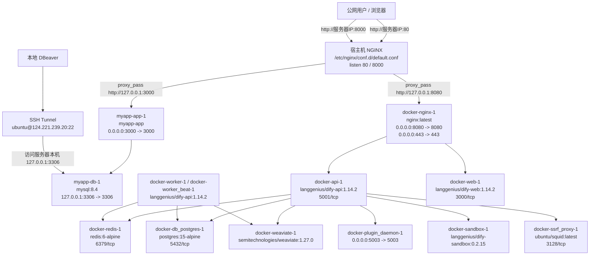

# 腾讯云 Docker / NGINX / Dify / MyApp 架构图

本文根据 `docker ps` 截图和 `/etc/nginx/conf.d/default.conf` 配置整理。

## 总体架构



## 宿主机 NGINX 转发关系

当前 `/etc/nginx/conf.d/default.conf` 的核心逻辑：

```text
公网访问 服务器IP:80
  -> 宿主机 NGINX
  -> proxy_pass http://127.0.0.1:8080
  -> Dify 的 docker-nginx-1

公网访问 服务器IP:8000
  -> 宿主机 NGINX
  -> proxy_pass http://127.0.0.1:3000
  -> myapp-app-1
```

## Docker 容器和端口

| 容器名 | 镜像 | 对外端口 / 内部端口 | 作用 |
|---|---|---:|---|
| `myapp-app-1` | `myapp-app` | `0.0.0.0:3000 -> 3000` | MyApp 应用服务 |
| `docker-nginx-1` | `nginx:latest` | `0.0.0.0:8080 -> 8080`, `0.0.0.0:443 -> 443` | Dify 前置 NGINX |
| `docker-api-1` | `langgenius/dify-api:1.14.2` | `5001/tcp` | Dify API |
| `docker-worker-1` | `langgenius/dify-api:1.14.2` | `5001/tcp` | Dify worker |
| `docker-worker_beat-1` | `langgenius/dify-api:1.14.2` | `5001/tcp` | Dify 定时任务 |
| `docker-api_websocket-1` | `langgenius/dify-api:1.14.2` | `5001/tcp` | Dify websocket |
| `docker-plugin_daemon-1` | `langgenius/dify-plugin-daemon:0.6.1-local` | `0.0.0.0:5003 -> 5003` | Dify 插件服务 |
| `docker-web-1` | `langgenius/dify-web:1.14.2` | `3000/tcp` | Dify Web |
| `docker-redis-1` | `redis:6-alpine` | `6379/tcp` | Dify Redis |
| `docker-sandbox-1` | `langgenius/dify-sandbox:0.2.15` | 内部端口 | Dify Sandbox |
| `docker-db_postgres-1` | `postgres:15-alpine` | `5432/tcp` | Dify PostgreSQL |
| `docker-ssrf_proxy-1` | `ubuntu/squid:latest` | `3128/tcp` | Dify SSRF Proxy |
| `docker-weaviate-1` | `semitechnologies/weaviate:1.27.0` | 内部端口 | Dify 向量数据库 |
| `myapp-db-1` | `mysql:8.4` | `127.0.0.1:3306 -> 3306`, `33060/tcp` | MyApp MySQL |

## DBeaver 连接 MySQL

MySQL 容器是：

```text
myapp-db-1
mysql:8.4
127.0.0.1:3306 -> 3306/tcp
```

这表示 MySQL 只绑定在服务器本机 `127.0.0.1:3306`，公网不能直接访问，这是比较安全的配置。

DBeaver 应使用 SSH Tunnel：

```text
DBeaver
  -> SSH Tunnel: ubuntu@124.221.239.20:22
  -> 服务器本机: 127.0.0.1:3306
  -> myapp-db-1:3306
```

DBeaver 主页面：

```text
Host: 127.0.0.1
Port: 3306
Database: 可空，或填写具体数据库名
Username: MySQL 用户名，例如 root 或 dbeaver
Password: MySQL 密码
```

DBeaver SSH 页面：

```text
Use SSH Tunnel: 勾选
Host/IP: 124.221.239.20
Port: 22
User Name: ubuntu
Authentication: 密码或私钥
Password / Private Key: 服务器 SSH 凭据
```

MySQL 8 如果提示：

```text
Public Key Retrieval is not allowed
```

在 DBeaver 驱动属性中添加：

```text
allowPublicKeyRetrieval = true
useSSL = false
```

或使用 JDBC URL：

```text
jdbc:mysql://127.0.0.1:3306/?allowPublicKeyRetrieval=true&useSSL=false
```

## 安全建议

当前可访问端口里有几个服务绑定到了 `0.0.0.0`：

```text
myapp-app-1: 0.0.0.0:3000 -> 3000
docker-nginx-1: 0.0.0.0:8080 -> 8080
docker-plugin_daemon-1: 0.0.0.0:5003 -> 5003
```

如果这些服务只希望通过宿主机 NGINX 访问，建议后续改成只绑定宿主机本地地址：

```yaml
ports:
  - "127.0.0.1:3000:3000"
  - "127.0.0.1:8080:8080"
```

腾讯云安全组建议只开放：

```text
22   仅允许你的本地公网 IP
80   HTTP
443  HTTPS
8000 如果仍然需要通过该端口访问 my-app
```

不建议开放：

```text
3306 MySQL
5432 PostgreSQL
6379 Redis
5003 Dify plugin daemon，除非你明确知道需要公网访问
```
